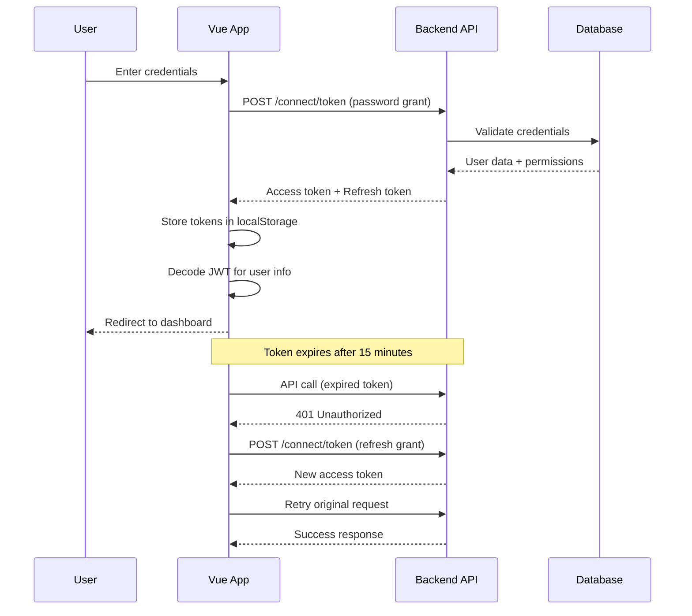

# Vue.js Authentication Integration Guide
## Multi-Tenant ETL Backend

---

## 📋 Table of Contents

1. [Overview](#overview)
2. [Backend API Endpoints](#backend-api-endpoints)
3. [Authentication Flow](#authentication-flow)
4. [Vue.js Setup](#vuejs-setup)
5. [Implementation Steps](#implementation-steps)
6. [Code Examples](#code-examples)
7. [Permission-Based UI](#permission-based-ui)
8. [Testing](#testing)
9. [Troubleshooting](#troubleshooting)

---

## Overview

The Multi-Tenant ETL backend provides a complete OAuth2/OpenIddict authentication system with the following features:

### Backend Features
- ✅ JWT-based authentication with OpenIddict
- ✅ Role-based authorization (SuperAdmin, TenantAdmin, User, Viewer)
- ✅ Permission-based access control with wildcards
- ✅ Multi-tenant support with tenant isolation
- ✅ Rate limiting (5 login attempts/minute)
- ✅ Email confirmation workflow
- ✅ Password reset functionality
- ✅ Tenant switching for users with multiple tenant access
- ✅ Refresh tokens (7-day expiry)
- ✅ Security headers (CORS, CSP, XSS protection)

### OAuth2 Configuration
- **Access Token Lifetime**: 15 minutes
- **Refresh Token Lifetime**: 7 days
- **Grant Types**: Password flow, Refresh token flow, Authorization code flow
- **Scopes**: `openid`, `email`, `profile`, `roles`, `api`, `offline_access`

---

## Backend API Endpoints

### Base URL
```
Development: http://localhost:5000
Production: https://your-api-domain.com
```

### Authentication Endpoints (OAuth2/OpenIddict)

| Endpoint | Method | Description |
|----------|--------|-------------|
| `/connect/token` | POST | Get access token (login) |
| `/connect/token` | POST | Refresh access token |
| `/connect/revoke` | POST | Revoke token (logout) |

### Account Management Endpoints

| Endpoint | Method | Auth Required | Description |
|----------|--------|---------------|-------------|
| `/api/account/register` | POST | ❌ | Register new user |
| `/api/account/confirm-email` | POST | ❌ | Confirm email address |
| `/api/account/forgot-password` | POST | ❌ | Request password reset |
| `/api/account/reset-password` | POST | ❌ | Reset password with token |
| `/api/account/change-password` | POST | ✅ | Change password (authenticated) |
| `/api/account/switch-tenant` | POST | ✅ | Switch between tenants |

---

## Authentication Flow



---

## Vue.js Setup

### Prerequisites

```bash
npm install axios jwt-decode
```

### Required Files

```
src/
├── services/
│   ├── auth.service.ts       # Authentication logic
│   └── api.service.ts         # Axios instance with interceptors
├── stores/
│   └── auth.store.ts          # Pinia/Vuex store (optional)
├── utils/
│   ├── jwt.utils.ts           # JWT decoding & permissions
│   └── permissions.ts         # Permission checking helpers
├── composables/
│   └── useAuth.ts             # Vue composable
├── router/
│   └── guards.ts              # Route guards
└── views/
    ├── Login.vue
    ├── Register.vue
    └── ForgotPassword.vue
```

---

## Implementation Steps

### Step 1: Create Auth Service

**File:** `src/services/auth.service.ts`

```typescript
import axios from 'axios';

const API_BASE = import.meta.env.VITE_API_URL || 'http://localhost:5000';

interface LoginRequest {
  username: string;
  password: string;
  client_id: string;
  grant_type: 'password';
  scope: string;
}

interface TokenResponse {
  access_token: string;
  refresh_token: string;
  expires_in: number;
  token_type: string;
}

interface RegisterRequest {
  email: string;
  password: string;
  firstName: string;
  lastName: string;
}

class AuthService {
  private readonly CLIENT_ID = 'multitenant-etl-postman';
  private readonly SCOPES = 'openid email profile roles api offline_access';

  /**
   * Login user with email and password
   */
  async login(email: string, password: string): Promise<TokenResponse> {
    const params = new URLSearchParams({
      username: email,
      password: password,
      client_id: this.CLIENT_ID,
      grant_type: 'password',
      scope: this.SCOPES,
    });

    const response = await axios.post<TokenResponse>(
      `${API_BASE}/connect/token`,
      params,
      {
        headers: {
          'Content-Type': 'application/x-www-form-urlencoded',
        },
      }
    );

    this.setTokens(response.data);
    return response.data;
  }

  /**
   * Register new user
   */
  async register(data: RegisterRequest): Promise<{ userId: string; message: string }> {
    const response = await axios.post(`${API_BASE}/api/account/register`, data);
    return response.data;
  }

  /**
   * Confirm email with token
   */
  async confirmEmail(userId: string, token: string): Promise<void> {
    await axios.post(`${API_BASE}/api/account/confirm-email`, {
      userId,
      token,
    });
  }

  /**
   * Request password reset email
   */
  async forgotPassword(email: string): Promise<void> {
    await axios.post(`${API_BASE}/api/account/forgot-password`, { email });
  }

  /**
   * Reset password with token
   */
  async resetPassword(userId: string, token: string, newPassword: string): Promise<void> {
    await axios.post(`${API_BASE}/api/account/reset-password`, {
      userId,
      token,
      newPassword,
    });
  }

  /**
   * Change password (authenticated)
   */
  async changePassword(currentPassword: string, newPassword: string): Promise<void> {
    const token = this.getAccessToken();
    await axios.post(
      `${API_BASE}/api/account/change-password`,
      { currentPassword, newPassword },
      { headers: { Authorization: `Bearer ${token}` } }
    );
  }

  /**
   * Switch tenant
   */
  async switchTenant(tenantId: string): Promise<void> {
    const token = this.getAccessToken();
    await axios.post(
      `${API_BASE}/api/account/switch-tenant`,
      { tenantId },
      { headers: { Authorization: `Bearer ${token}` } }
    );
    
    // Refresh token to get new tenant claims
    await this.refreshToken();
  }

  /**
   * Refresh access token
   */
  async refreshToken(): Promise<TokenResponse> {
    const refreshToken = this.getRefreshToken();
    if (!refreshToken) {
      throw new Error('No refresh token available');
    }

    const params = new URLSearchParams({
      client_id: this.CLIENT_ID,
      grant_type: 'refresh_token',
      refresh_token: refreshToken,
      scope: this.SCOPES,
    });

    const response = await axios.post<TokenResponse>(
      `${API_BASE}/connect/token`,
      params,
      {
        headers: {
          'Content-Type': 'application/x-www-form-urlencoded',
        },
      }
    );

    this.setTokens(response.data);
    return response.data;
  }

  /**
   * Logout (clear tokens)
   */
  logout(): void {
    localStorage.removeItem('access_token');
    localStorage.removeItem('refresh_token');
  }

  /**
   * Check if user is authenticated
   */
  isAuthenticated(): boolean {
    const token = this.getAccessToken();
    if (!token) return false;

    // Check if token is expired
    try {
      const payload = JSON.parse(atob(token.split('.')[1]));
      return payload.exp * 1000 > Date.now();
    } catch {
      return false;
    }
  }

  // Token storage helpers
  private setTokens(data: TokenResponse): void {
    localStorage.setItem('access_token', data.access_token);
    localStorage.setItem('refresh_token', data.refresh_token);
  }

  getAccessToken(): string | null {
    return localStorage.getItem('access_token');
  }

  getRefreshToken(): string | null {
    return localStorage.getItem('refresh_token');
  }
}

export const authService = new AuthService();
```

---

### Step 2: Create API Service with Interceptors

**File:** `src/services/api.service.ts`

```typescript
import axios, { AxiosError, InternalAxiosRequestConfig } from 'axios';
import { authService } from './auth.service';

const API_BASE = import.meta.env.VITE_API_URL || 'http://localhost:5000';

// Create axios instance
export const api = axios.create({
  baseURL: API_BASE,
  headers: {
    'Content-Type': 'application/json',
  },
});

// Request interceptor - add auth token
api.interceptors.request.use(
  (config: InternalAxiosRequestConfig) => {
    const token = authService.getAccessToken();
    if (token && config.headers) {
      config.headers.Authorization = `Bearer ${token}`;
    }
    return config;
  },
  (error) => Promise.reject(error)
);

// Response interceptor - handle token refresh
api.interceptors.response.use(
  (response) => response,
  async (error: AxiosError) => {
    const originalRequest = error.config as InternalAxiosRequestConfig & { _retry?: boolean };

    // If 401 and not already retried, try to refresh token
    if (error.response?.status === 401 && !originalRequest._retry) {
      originalRequest._retry = true;

      try {
        await authService.refreshToken();
        
        // Retry original request with new token
        const token = authService.getAccessToken();
        if (originalRequest.headers && token) {
          originalRequest.headers.Authorization = `Bearer ${token}`;
        }
        
        return api(originalRequest);
      } catch (refreshError) {
        // Refresh failed - logout and redirect to login
        authService.logout();
        window.location.href = '/login';
        return Promise.reject(refreshError);
      }
    }

    return Promise.reject(error);
  }
);

export default api;
```

---

### Step 3: JWT Utilities

**File:** `src/utils/jwt.utils.ts`

```typescript
import { jwtDecode } from 'jwt-decode';

export interface JwtPayload {
  sub: string;           // User ID
  email: string;
  name: string;
  role: string;          // Current role
  tenant_id: string;     // Current tenant ID
  tenant_name: string;   // Current tenant name
  permissions: string;   // JSON array of permissions
  exp: number;           // Expiration timestamp
  iat: number;           // Issued at timestamp
}

/**
 * Get current user from JWT token
 */
export function getCurrentUser(): JwtPayload | null {
  const token = localStorage.getItem('access_token');
  if (!token) return null;

  try {
    return jwtDecode<JwtPayload>(token);
  } catch (error) {
    console.error('Failed to decode JWT:', error);
    return null;
  }
}

/**
 * Get user permissions from JWT
 */
export function getUserPermissions(): string[] {
  const user = getCurrentUser();
  if (!user || !user.permissions) return [];

  try {
    return JSON.parse(user.permissions);
  } catch {
    return [];
  }
}

/**
 * Check if user has specific permission
 * Supports wildcards: "pipelines:*", "*:read", "*:*"
 */
export function hasPermission(permission: string): boolean {
  const permissions = getUserPermissions();
  
  // Check exact match
  if (permissions.includes(permission)) return true;
  
  // Check wildcards
  const [resource, action] = permission.split(':');
  if (!resource || !action) return false;
  
  // Check resource:* (e.g., "pipelines:*")
  if (permissions.includes(`${resource}:*`)) return true;
  
  // Check *:action (e.g., "*:read")
  if (permissions.includes(`*:${action}`)) return true;
  
  // Check super admin *:*
  if (permissions.includes('*:*')) return true;
  
  return false;
}

/**
 * Check if user has specific role
 */
export function hasRole(role: string): boolean {
  const user = getCurrentUser();
  return user?.role === role;
}

/**
 * Check if user is SuperAdmin
 */
export function isSuperAdmin(): boolean {
  return hasRole('SuperAdmin');
}

/**
 * Check if user is admin (SuperAdmin or TenantAdmin)
 */
export function isAdmin(): boolean {
  const user = getCurrentUser();
  return user?.role === 'SuperAdmin' || user?.role === 'TenantAdmin';
}
```

---

### Step 4: Vue Composable

**File:** `src/composables/useAuth.ts`

```typescript
import { ref, computed } from 'vue';
import { authService } from '@/services/auth.service';
import { getCurrentUser, hasPermission, hasRole, type JwtPayload } from '@/utils/jwt.utils';

export function useAuth() {
  const user = ref<JwtPayload | null>(getCurrentUser());
  const loading = ref(false);
  const error = ref<string | null>(null);

  // Computed properties
  const isAuthenticated = computed(() => authService.isAuthenticated());
  const currentTenant = computed(() => user.value?.tenant_name);
  const userRole = computed(() => user.value?.role);

  /**
   * Login user
   */
  async function login(email: string, password: string): Promise<void> {
    loading.value = true;
    error.value = null;

    try {
      await authService.login(email, password);
      user.value = getCurrentUser();
    } catch (err: any) {
      error.value = err.response?.data?.error_description || 'Login failed';
      throw err;
    } finally {
      loading.value = false;
    }
  }

  /**
   * Register new user
   */
  async function register(data: {
    email: string;
    password: string;
    firstName: string;
    lastName: string;
  }): Promise<void> {
    loading.value = true;
    error.value = null;

    try {
      await authService.register(data);
    } catch (err: any) {
      error.value = err.response?.data?.error?.message || 'Registration failed';
      throw err;
    } finally {
      loading.value = false;
    }
  }

  /**
   * Logout user
   */
  function logout(): void {
    authService.logout();
    user.value = null;
  }

  /**
   * Switch tenant
   */
  async function switchTenant(tenantId: string): Promise<void> {
    loading.value = true;
    error.value = null;

    try {
      await authService.switchTenant(tenantId);
      user.value = getCurrentUser();
    } catch (err: any) {
      error.value = err.response?.data?.error?.message || 'Failed to switch tenant';
      throw err;
    } finally {
      loading.value = false;
    }
  }

  /**
   * Change password
   */
  async function changePassword(currentPassword: string, newPassword: string): Promise<void> {
    loading.value = true;
    error.value = null;

    try {
      await authService.changePassword(currentPassword, newPassword);
    } catch (err: any) {
      error.value = err.response?.data?.error?.message || 'Failed to change password';
      throw err;
    } finally {
      loading.value = false;
    }
  }

  /**
   * Check permission
   */
  function can(permission: string): boolean {
    return hasPermission(permission);
  }

  /**
   * Check role
   */
  function isRole(role: string): boolean {
    return hasRole(role);
  }

  return {
    // State
    user,
    loading,
    error,
    isAuthenticated,
    currentTenant,
    userRole,

    // Methods
    login,
    register,
    logout,
    switchTenant,
    changePassword,
    can,
    isRole,
  };
}
```

---

### Step 5: Router Guards

**File:** `src/router/guards.ts`

```typescript
import type { NavigationGuardNext, RouteLocationNormalized } from 'vue-router';
import { authService } from '@/services/auth.service';
import { hasPermission } from '@/utils/jwt.utils';

/**
 * Require authentication
 */
export function requireAuth(
  to: RouteLocationNormalized,
  from: RouteLocationNormalized,
  next: NavigationGuardNext
): void {
  if (authService.isAuthenticated()) {
    next();
  } else {
    next({ name: 'Login', query: { redirect: to.fullPath } });
  }
}

/**
 * Require specific permission
 */
export function requirePermission(permission: string) {
  return (
    to: RouteLocationNormalized,
    from: RouteLocationNormalized,
    next: NavigationGuardNext
  ): void => {
    if (!authService.isAuthenticated()) {
      next({ name: 'Login', query: { redirect: to.fullPath } });
      return;
    }

    if (hasPermission(permission)) {
      next();
    } else {
      next({ name: 'Forbidden' });
    }
  };
}

/**
 * Redirect authenticated users (e.g., login page)
 */
export function redirectIfAuth(
  to: RouteLocationNormalized,
  from: RouteLocationNormalized,
  next: NavigationGuardNext
): void {
  if (authService.isAuthenticated()) {
    next({ name: 'Dashboard' });
  } else {
    next();
  }
}
```

**File:** `src/router/index.ts`

```typescript
import { createRouter, createWebHistory } from 'vue-router';
import { requireAuth, requirePermission, redirectIfAuth } from './guards';

const router = createRouter({
  history: createWebHistory(),
  routes: [
    {
      path: '/login',
      name: 'Login',
      component: () => import('@/views/Login.vue'),
      beforeEnter: redirectIfAuth,
    },
    {
      path: '/register',
      name: 'Register',
      component: () => import('@/views/Register.vue'),
      beforeEnter: redirectIfAuth,
    },
    {
      path: '/dashboard',
      name: 'Dashboard',
      component: () => import('@/views/Dashboard.vue'),
      beforeEnter: requireAuth,
    },
    {
      path: '/pipelines',
      name: 'Pipelines',
      component: () => import('@/views/Pipelines.vue'),
      beforeEnter: requirePermission('pipelines:read'),
    },
    {
      path: '/users',
      name: 'Users',
      component: () => import('@/views/Users.vue'),
      beforeEnter: requirePermission('users:read'),
    },
    {
      path: '/forbidden',
      name: 'Forbidden',
      component: () => import('@/views/Forbidden.vue'),
    },
  ],
});

export default router;
```

---

## Code Examples

### Login Component

**File:** `src/views/Login.vue`

```vue
<template>
  <div class="login-container">
    <div class="login-card">
      <h1>Login</h1>
      
      <form @submit.prevent="handleLogin">
        <div class="form-group">
          <label for="email">Email</label>
          <input
            id="email"
            v-model="form.email"
            type="email"
            required
            placeholder="admin@multitenant-etl.com"
          />
        </div>

        <div class="form-group">
          <label for="password">Password</label>
          <input
            id="password"
            v-model="form.password"
            type="password"
            required
            placeholder="••••••••"
          />
        </div>

        <div v-if="error" class="error-message">
          {{ error }}
        </div>

        <button type="submit" :disabled="loading" class="btn-primary">
          {{ loading ? 'Logging in...' : 'Login' }}
        </button>
      </form>

      <div class="links">
        <router-link to="/forgot-password">Forgot password?</router-link>
        <router-link to="/register">Create account</router-link>
      </div>
    </div>
  </div>
</template>

<script setup lang="ts">
import { reactive } from 'vue';
import { useRouter, useRoute } from 'vue-router';
import { useAuth } from '@/composables/useAuth';

const router = useRouter();
const route = useRoute();
const { login, loading, error } = useAuth();

const form = reactive({
  email: '',
  password: '',
});

async function handleLogin() {
  try {
    await login(form.email, form.password);
    
    // Redirect to original page or dashboard
    const redirect = route.query.redirect as string || '/dashboard';
    router.push(redirect);
  } catch (err) {
    // Error is already set in useAuth
  }
}
</script>

<style scoped>
.login-container {
  display: flex;
  align-items: center;
  justify-content: center;
  min-height: 100vh;
  background: linear-gradient(135deg, #667eea 0%, #764ba2 100%);
}

.login-card {
  background: white;
  padding: 2rem;
  border-radius: 8px;
  box-shadow: 0 4px 6px rgba(0, 0, 0, 0.1);
  width: 100%;
  max-width: 400px;
}

.form-group {
  margin-bottom: 1rem;
}

.form-group label {
  display: block;
  margin-bottom: 0.5rem;
  font-weight: 500;
}

.form-group input {
  width: 100%;
  padding: 0.75rem;
  border: 1px solid #ddd;
  border-radius: 4px;
  font-size: 1rem;
}

.error-message {
  color: #dc3545;
  background: #f8d7da;
  padding: 0.75rem;
  border-radius: 4px;
  margin-bottom: 1rem;
}

.btn-primary {
  width: 100%;
  padding: 0.75rem;
  background: linear-gradient(135deg, #667eea 0%, #764ba2 100%);
  color: white;
  border: none;
  border-radius: 4px;
  font-size: 1rem;
  font-weight: 600;
  cursor: pointer;
}

.btn-primary:disabled {
  opacity: 0.6;
  cursor: not-allowed;
}

.links {
  margin-top: 1rem;
  display: flex;
  justify-content: space-between;
  font-size: 0.9rem;
}
</style>
```

---

### Register Component

**File:** `src/views/Register.vue`

```vue
<template>
  <div class="register-container">
    <div class="register-card">
      <h1>Create Account</h1>
      
      <form @submit.prevent="handleRegister">
        <div class="form-row">
          <div class="form-group">
            <label for="firstName">First Name</label>
            <input
              id="firstName"
              v-model="form.firstName"
              type="text"
              required
              placeholder="John"
            />
          </div>

          <div class="form-group">
            <label for="lastName">Last Name</label>
            <input
              id="lastName"
              v-model="form.lastName"
              type="text"
              required
              placeholder="Doe"
            />
          </div>
        </div>

        <div class="form-group">
          <label for="email">Email</label>
          <input
            id="email"
            v-model="form.email"
            type="email"
            required
            placeholder="john@example.com"
          />
        </div>

        <div class="form-group">
          <label for="password">Password</label>
          <input
            id="password"
            v-model="form.password"
            type="password"
            required
            placeholder="Min. 8 characters"
          />
          <small>Must contain uppercase, lowercase, digit, and special character</small>
        </div>

        <div v-if="error" class="error-message">
          {{ error }}
        </div>

        <div v-if="success" class="success-message">
          {{ success }}
        </div>

        <button type="submit" :disabled="loading" class="btn-primary">
          {{ loading ? 'Creating account...' : 'Register' }}
        </button>
      </form>

      <div class="links">
        <router-link to="/login">Already have an account? Login</router-link>
      </div>
    </div>
  </div>
</template>

<script setup lang="ts">
import { reactive, ref } from 'vue';
import { useRouter } from 'vue-router';
import { useAuth } from '@/composables/useAuth';

const router = useRouter();
const { register, loading, error } = useAuth();
const success = ref('');

const form = reactive({
  email: '',
  password: '',
  firstName: '',
  lastName: '',
});

async function handleRegister() {
  success.value = '';
  
  try {
    await register(form);
    success.value = 'Account created! Please check your email to confirm.';
    
    setTimeout(() => {
      router.push('/login');
    }, 3000);
  } catch (err) {
    // Error is already set in useAuth
  }
}
</script>
```

---

### Dashboard with Permissions

**File:** `src/views/Dashboard.vue`

```vue
<template>
  <div class="dashboard">
    <header class="dashboard-header">
      <h1>Dashboard</h1>
      <div class="user-info">
        <span>{{ user?.name }}</span>
        <span class="tenant-badge">{{ user?.tenant_name }}</span>
        <span class="role-badge">{{ user?.role }}</span>
        <button @click="handleLogout" class="btn-logout">Logout</button>
      </div>
    </header>

    <div class="dashboard-content">
      <!-- Only show if user has permission -->
      <div v-if="can('pipelines:read')" class="card">
        <h2>Pipelines</h2>
        <p>You have access to pipelines</p>
        <router-link v-if="can('pipelines:create')" to="/pipelines/create">
          Create Pipeline
        </router-link>
      </div>

      <div v-if="can('users:read')" class="card">
        <h2>Users</h2>
        <p>Manage users</p>
        <router-link to="/users">View Users</router-link>
      </div>

      <div v-if="isRole('SuperAdmin')" class="card">
        <h2>System Settings</h2>
        <p>SuperAdmin only</p>
      </div>

      <!-- Show if no permissions -->
      <div v-if="!hasAnyPermission" class="card">
        <p>You don't have access to any features yet.</p>
      </div>
    </div>
  </div>
</template>

<script setup lang="ts">
import { computed } from 'vue';
import { useRouter } from 'vue-router';
import { useAuth } from '@/composables/useAuth';

const router = useRouter();
const { user, logout, can, isRole } = useAuth();

const hasAnyPermission = computed(() => {
  return can('pipelines:read') || can('users:read');
});

function handleLogout() {
  logout();
  router.push('/login');
}
</script>
```

---

## Permission-Based UI

### Custom Directive for Permissions

**File:** `src/directives/permission.ts`

```typescript
import type { Directive } from 'vue';
import { hasPermission } from '@/utils/jwt.utils';

/**
 * v-permission directive
 * Usage: v-permission="'pipelines:create'"
 * Hides element if user doesn't have permission
 */
export const vPermission: Directive = {
  mounted(el, binding) {
    const permission = binding.value;
    if (!hasPermission(permission)) {
      el.style.display = 'none';
    }
  },
};

/**
 * Register in main.ts:
 * app.directive('permission', vPermission);
 */
```

**Usage:**
```vue
<template>
  <button v-permission="'pipelines:delete'" @click="deletePipeline">
    Delete
  </button>
</template>
```

---

## Testing

### Test Credentials

From `DbSeeder.cs`:
- **Email**: `admin@multitenant-etl.com`
- **Password**: `Admin@123456` (or check your user secrets)
- **Role**: SuperAdmin
- **Tenant**: Default Organization

### Manual Testing Steps

1. **Test Registration:**
   ```bash
   POST /api/account/register
   {
     "email": "test@example.com",
     "password": "Test@123456",
     "firstName": "Test",
     "lastName": "User"
   }
   ```

2. **Test Login:**
   ```bash
   POST /connect/token
   Content-Type: application/x-www-form-urlencoded
   
   username=admin@multitenant-etl.com&
   password=Admin@123456&
   client_id=multitenant-etl-postman&
   grant_type=password&
   scope=openid email profile roles api offline_access
   ```

3. **Test Protected Endpoint:**
   ```bash
   GET /api/some-protected-endpoint
   Authorization: Bearer {access_token}
   ```

4. **Test Token Refresh:**
   ```bash
   POST /connect/token
   Content-Type: application/x-www-form-urlencoded
   
   client_id=multitenant-etl-postman&
   grant_type=refresh_token&
   refresh_token={refresh_token}
   ```

---

## Troubleshooting

### Common Issues

#### 1. CORS Errors

**Error:** `Access to XMLHttpRequest blocked by CORS policy`

**Solution:** Backend already configured for `http://localhost:5173`. If using different port:
```json
// appsettings.json
{
  "Cors": {
    "AllowedOrigins": [
      "http://localhost:5173",
      "http://localhost:YOUR_PORT"
    ]
  }
}
```

#### 2. 401 Unauthorized After Login

**Error:** Token present but getting 401

**Solution:** Check if token is being sent correctly:
```typescript
// In api.service.ts, verify interceptor adds Bearer prefix
config.headers.Authorization = `Bearer ${token}`;
```

#### 3. Permissions Not Working

**Error:** User has role but can't access features

**Solution:** Decode JWT and check permissions:
```typescript
import { getCurrentUser } from '@/utils/jwt.utils';
console.log(getCurrentUser());
```

Verify permissions are in JWT claims.

#### 4. Token Not Refreshing

**Error:** 401 errors not triggering refresh

**Solution:** Check interceptor is registered:
```typescript
// Ensure api.service.ts is imported before making any requests
import '@/services/api.service';
```

#### 5. Rate Limiting

**Error:** 429 Too Many Requests

**Solution:** Backend limits login to 5 attempts/minute. Wait or adjust in `Program.cs`:
```csharp
new RateLimitRule
{
    Endpoint = "POST:/connect/token",
    Period = "1m",
    Limit = 5  // Increase if needed
}
```

---

## Environment Variables

**File:** `.env`

```bash
VITE_API_URL=http://localhost:5000
```

**File:** `.env.production`

```bash
VITE_API_URL=https://your-production-api.com
```

---

## Summary

Your backend provides a complete, production-ready authentication system with:

- ✅ OAuth2/OpenIddict with JWT tokens
- ✅ Role-based and permission-based authorization
- ✅ Multi-tenant support
- ✅ Security features (rate limiting, CORS, CSP)
- ✅ Email workflows (confirmation, reset)
- ✅ Token refresh mechanism

**Integration Checklist:**
- [ ] Install dependencies (`axios`, `jwt-decode`)
- [ ] Create auth service (`auth.service.ts`)
- [ ] Create API service with interceptors (`api.service.ts`)
- [ ] Create JWT utilities (`jwt.utils.ts`)
- [ ] Create Vue composable (`useAuth.ts`)
- [ ] Setup router guards (`guards.ts`)
- [ ] Create Login/Register views
- [ ] Test authentication flow
- [ ] Implement permission-based UI
- [ ] Test all auth workflows

**Need help?** Check the code examples above or refer to your backend documentation at `docs/auth/`.
